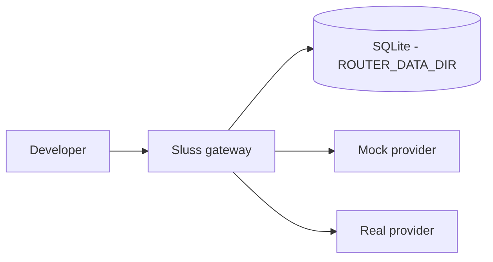

# Deployment topology

## Lokal utveckling



Komponenter: gatewayn (`make dev`) och valfritt mock-providern (`make run-mock`). Inga externa tjänster.

## Skalningsprinciper

- Policy och registry laddas vid startup och kan hot-reloadas.
- En nod räcker för målsegmentet; multi-nod med Postgres/Redis är Enterprise 2.0-spåret (se nedan).
- Asynkron in-process-loggning skyddar API-latency.

## Regioner

MVP kan köras i en region. Team/enterprise bör överväga:

- Region per tenant.
- Providerregioner.
- Data residency.
- Regional failover.

## Kapacitet

Dimensionera för:

- Peak RPS.
- Streaming-connection count.
- Provider rate limits.
- Event queue backlog.
- Dashboard query load.

## Rollout

1. Intern dogfood.
2. Shadow mode.
3. 10 procent traffic.
4. Full beta.
5. Production hardening.

## Container deploy (Docker / EasyPanel / any PaaS)

The router runs as a **single self-contained container** — it needs no database
to boot (in-memory trackers; the provider is reached over HTTPS), so the
`Dockerfile` at the repo root is a complete deployment. The image is a static Go
binary on Alpine (~32 MB) running as non-root, with a `/healthz` healthcheck.

```bash
docker build -t tokenizer-router .
docker run -p 8080:8080 \
  -e LOCAL_API_KEY=<strong-secret> \
  -e OPENROUTER_API_KEY=<sk-or-...> \
  tokenizer-router
```

**EasyPanel (or similar Git-driven PaaS):**

1. Create an **App** → source = this GitHub repo → build = **Dockerfile** (path `./Dockerfile`).
2. Paste env vars in the UI (see `.env.example`). Minimum for a real provider:
   - `LOCAL_API_KEY` — a **strong secret** clients send as `Authorization: Bearer …` (never the dev default `local_router_key`).
   - `OPENROUTER_API_KEY` — routes through OpenRouter; omit to fall back to the mock provider.
   - Optional: `ROUTER_BUDGET_USD` (spend cap), `ROUTER_RETENTION_DAYS`, `ROUTER_CONSERVATIVE_MODE`, etc.
3. Expose container port **8080**; point the platform healthcheck at `GET /healthz`.
4. Point any OpenAI-compatible client at `https://<your-domain>/v1` with `model: "auto"`.

Notes:
- **No Postgres/Redis required** for the router itself; add them only if/when persistent request logs or cross-restart spend are wired in.
- Secrets live in the platform's env UI, never in the image — `.dockerignore` excludes `.env`.

## Storage ladder: v1.0 vs Enterprise 2.0

Decided 2026-07-04 (DECISION_LOG). State lives where the deployment stage needs it —
never earlier:

| Stage | State | Trigger |
|---|---|---|
| **v1.0 (nu)** | One container. Fast path in-memory; durable history (request log, spend/savings, closed-loop data) **and the roster** (provider connections + which model fills which tier) in **SQLite** on the mounted volume (ISSUE-070/073, `modernc.org/sqlite` — CGO-free, static binary preserved) | Pilot & single-node enterprise |
| **Enterprise 2.0** | + **Redis** as shared replica state (provider health, budget counters, session stickiness, decision cache) | The moment a **second router replica** runs (HA/SLA — not capacity: one container handled 6,700 req/s in load test) |
| **Enterprise 2.0** | + **Postgres** as multi-writer source of truth (tenants, keys, full history **and the roster** at fleet scale; `db/migrations/` already anticipates the schema) | Multi-node / multi-writer |

### Roster: SQLite is the source of truth (ISSUE-073)

The **roster** — the provider connections and which model fills which routing
tier — lives in the same `history.db` under `ROUTER_DATA_DIR`, in two tables:
`roster_providers` (id, name, base_url, key_env) and `roster_models` (id,
provider_id, provider_model_id, tier, prices, enabled). The DB controls
tier→model; routing (`task → tier`) stays automatic (the product's USP) and is
never touched here.

- **Keys never live in the DB.** A provider references the *name* of the env var
  holding its key (`key_env`); the value is resolved from the environment at
  startup (the CISO posture). The DB holds only non-secret connection config.
- **Seed on first run.** An empty DB is seeded with the built-in OpenRouter
  connection + three tier models as data (nothing hardcoded), so everything is
  re-tierable from the Models admin page.
- **One-time migration.** An existing `models.json` / `providers.json` roster
  (ISSUE-072) is imported into the tables on first boot and the files renamed
  `.imported` (mirroring the `spend.json` → history import).
- **Applies on restart (v1.0).** The registry is built from the DB roster at
  startup. Tier/model edits on the Models page take effect on the next
  restart/redeploy; a *new* provider also needs its key added to the env, which
  is a redeploy anyway. (Live hot-reload of tier→model without a restart is the
  ISSUE-073 Phase 2 follow-up.)
- **`ROUTER_MODEL_<TIER>` is a legacy convenience.** It still swaps the slug that
  fills a tier, but now that the DB owns the roster it is **written through to the
  DB at startup** so the persisted roster and routing agree (no UI/routing
  mismatch). Prefer editing the model on the Models page instead.

Rationale: the event queue is already a single async writer and the dashboard is
read-heavy — SQLite's sweet spot (concept borrowed from the sister project
agentanbud: "en container, en SQLite-fil, en cron-rad"). Redis is replica glue,
nothing else; in-memory beats it on every axis for a single instance.

## Blue/green policy deploy

Policy bör deployas separat från kod:

- Skapa ny policyversion.
- Simulera mot evals.
- Aktivera för intern tenant.
- Aktivera för pilotprojekt.
- Aktivera globalt.
